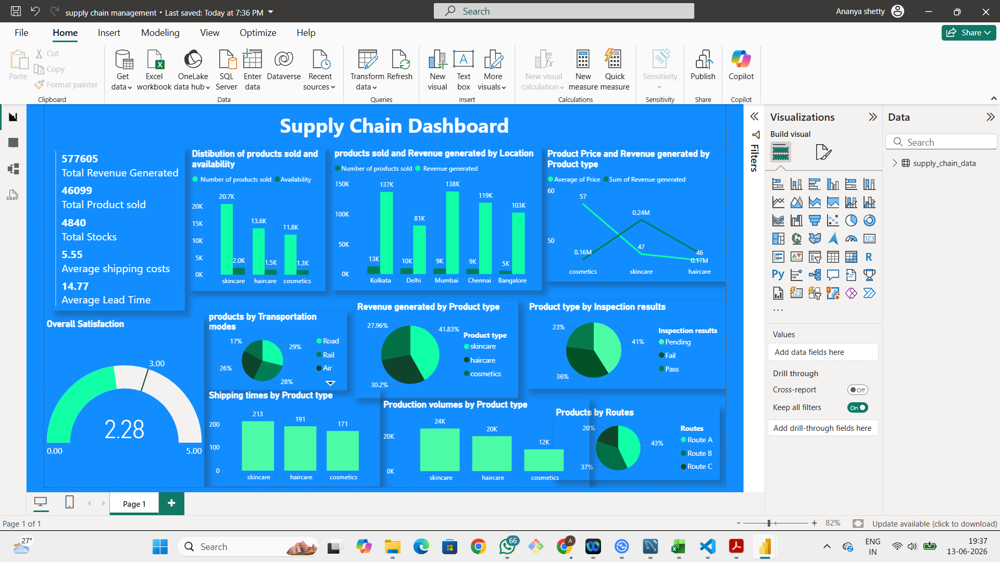

# Supply Chain Analytics Dashboard

## Project Overview

This project focuses on analyzing supply chain operations using Power BI to uncover insights related to revenue generation, inventory management, transportation efficiency, product performance, and customer satisfaction.

The dashboard provides stakeholders with a comprehensive view of supply chain performance through interactive visualizations, KPI tracking, and business-focused insights that support data-driven decision-making.

---

## Objectives

* Monitor revenue and product sales performance.
* Analyze inventory availability and stock levels.
* Evaluate transportation modes and route efficiency.
* Track delivery lead times and shipping costs.
* Measure customer satisfaction and operational effectiveness.
* Identify high-performing products and locations.

---

## Tools & Technologies

* Power BI
* Microsoft Excel
* SQL
* Data Visualization
* Business Intelligence Reporting

---

## Dataset Overview

The dataset contains information related to:

* Product Categories
* Revenue Generated
* Inventory Levels
* Transportation Modes
* Delivery Routes
* Shipping Costs
* Lead Time
* Inspection Results
* Customer Satisfaction Scores
* Location-wise Sales Performance

---

## Dashboard Features

### Executive KPIs

* Total Revenue Generated
* Total Products Sold
* Total Inventory Stock
* Average Shipping Cost
* Average Lead Time
* Customer Satisfaction Score

### Product Analysis

* Revenue by Product Category
* Product Availability Analysis
* Production Volume Comparison
* Product Pricing Insights

### Regional Analysis

* Revenue by Location
* Product Sales by Location
* Performance Comparison Across Cities

### Logistics Analysis

* Transportation Mode Distribution
* Route Utilization Analysis
* Lead Time Monitoring
* Shipping Cost Evaluation

### Quality Analysis

* Inspection Results Tracking
* Pass, Fail, and Pending Status Distribution

---

## Key Business Insights

* Skincare emerged as the highest revenue-generating product category.
* Mumbai recorded the highest overall revenue performance.
* Kolkata led in product sales volume.
* Road transportation was the most utilized shipping method.
* Route A handled over 43% of total product movement.
* Customer satisfaction remained below the target benchmark, highlighting opportunities for service improvement.
* Average delivery lead time was approximately 15 days.

---

## Skills Demonstrated

### Data Analytics

* Data Cleaning
* Data Transformation
* Data Interpretation

### Business Intelligence

* KPI Development
* Dashboard Design
* Executive Reporting

### Power BI

* Interactive Visualizations
* DAX Measures
* Data Modeling
* Drill-Down Analysis

### Business Analysis

* Supply Chain Analytics
* Logistics Performance Analysis
* Revenue Analysis
* Inventory Analysis

---

## Dashboard Preview

Add your dashboard screenshot here:

---

## Business Impact

This dashboard enables organizations to:

* Improve operational visibility.
* Identify revenue-driving product categories.
* Optimize transportation and delivery performance.
* Monitor inventory levels effectively.
* Support strategic business decisions through data-driven insights.

---

## Author

**Ananya Shetty**

Aspiring Data Analyst skilled in SQL, Python, Power BI, Excel, and Business Intelligence with a strong interest in transforming data into actionable insights.
